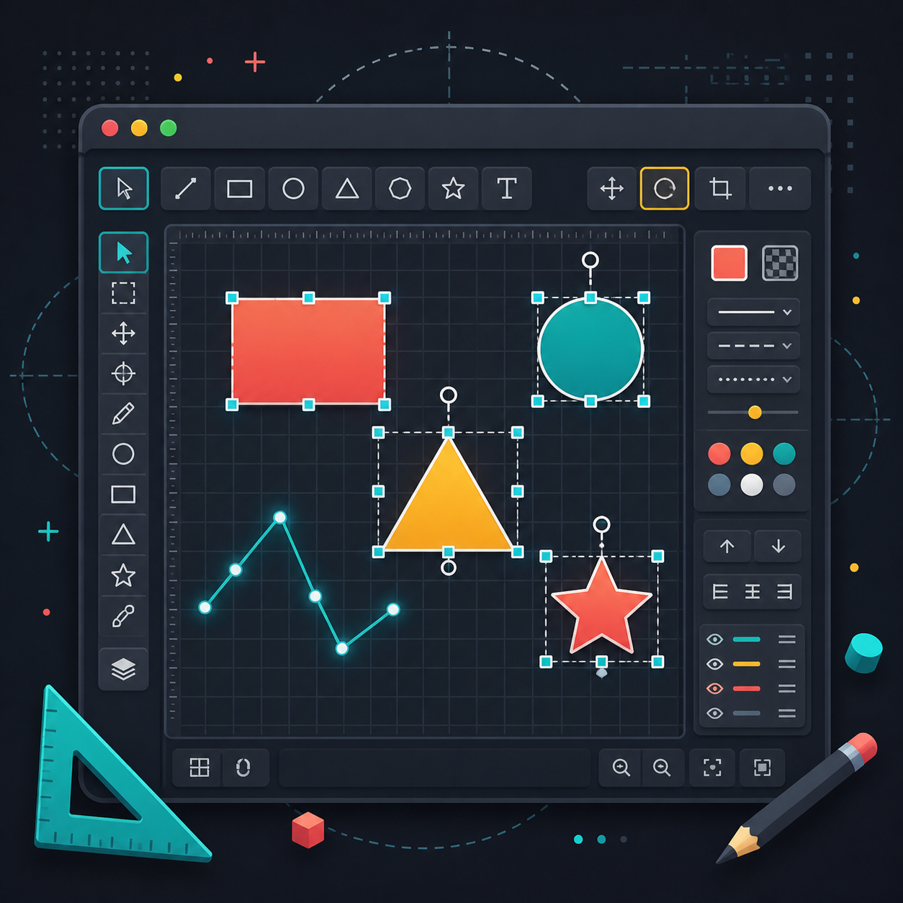

# OpenGL 2D CAD Editor

<p align="center">
 
</p>

<p align="center">
  <em>Create, edit, transform, and manage 2D CAD-style drawings with a Python, Pygame, and OpenGL based desktop editor.</em>
</p>

<p align="center">
  
  
  
  
</p>
A lightweight 2D CAD editor built with Python, Pygame, and PyOpenGL. The project provides an interactive drawing canvas with shape creation, selection, transformation, styling, layer ordering, and scene persistence features.

## Demo Video

[▶️ Watch the demo video](https://youtu.be/FrOTqft9TfM)

## Overview

OpenGL 2D CAD Editor is designed as an educational and interactive desktop drawing application. It combines a real-time OpenGL rendering pipeline with a simple CAD-style interface, allowing users to create and manipulate 2D geometric objects on a grid-based canvas.

The editor supports common CAD interactions such as selecting objects, moving shapes, rotating and scaling elements, editing visual properties, and saving or loading scene data.

## Features

- Interactive 2D drawing canvas
- OpenGL-based rendering
- Grid display and snap-style canvas interaction
- Shape creation tools
- Object selection and transformation
- Move, rotate, and scale operations
- Line, rectangle, circle, triangle, and additional shape support
- Dynamic and static shape handling
- Stroke and fill color editing
- Line width and style customization
- Bring-to-front and send-to-back layer controls
- Duplicate and delete actions
- Scene save and load support using JSON
- PNG export support
- Toolbar, properties panel, and status bar interface
- Camera/global canvas rotation support
- Join and explode tools for shape workflows

## Tech Stack

- Python
- Pygame
- PyOpenGL
- PyOpenGL Accelerate
- NumPy

## Project Structure

```text
opengl-2d-cad-editor/
├── assets/
├── docs/
├── screenshots/
├── src/
│   ├── assets/
│   │   ├── fonts/
│   │   └── icons/
│   ├── core/
│   │   ├── scene.py
│   │   └── transform.py
│   ├── shapes/
│   │   ├── base.py
│   │   ├── circle.py
│   │   ├── ellipse.py
│   │   ├── line.py
│   │   ├── polygon.py
│   │   ├── polyline.py
│   │   ├── rectangle.py
│   │   ├── star.py
│   │   └── triangle.py
│   ├── ui/
│   │   ├── properties_panel.py
│   │   ├── status_bar.py
│   │   └── toolbar.py
│   ├── utils/
│   │   ├── constants.py
│   │   ├── file_ops.py
│   │   └── fonts.py
│   ├── app.py
│   ├── input_handler.py
│   ├── main.py
│   └── renderer.py
├── requirements.txt
├── scene.json
└── README.md
```

## Installation

Clone the repository:

```bash
git clone https://github.com/GraphiCore-Lab/opengl-2d-cad-editor.git
cd opengl-2d-cad-editor
```

Create a virtual environment:

```bash
python -m venv .venv
```

Activate the virtual environment.

On Windows:

```bash
.venv\Scripts\activate
```

On macOS or Linux:

```bash
source .venv/bin/activate
```

Install dependencies:

```bash
pip install -r requirements.txt
```

## Running the Application

Run the project from the root directory:

```bash
python src/main.py
```

The application window should open with the CAD editor interface.

## VS Code Setup

If you want to run the project directly from VS Code, open the project folder and create a `.vscode/launch.json` file with the following configuration:

```json
{
  "version": "0.2.0",
  "configurations": [
    {
      "name": "Run CAD Editor",
      "type": "debugpy",
      "request": "launch",
      "program": "${workspaceFolder}/src/main.py",
      "console": "integratedTerminal",
      "cwd": "${workspaceFolder}"
    }
  ]
}
```

After this setup, the project can be started from the **Run and Debug** panel or with `F5`.

## Usage

Use the toolbar to choose drawing and editing tools. Objects can be created directly on the canvas and then selected for further manipulation.

Available interactions include:

- Drawing geometric shapes
- Selecting existing objects
- Moving selected objects
- Rotating objects
- Scaling objects
- Editing stroke and fill colors
- Adjusting line styles
- Changing object order
- Duplicating objects
- Saving and loading scenes

## Scene Files

The editor uses JSON-based scene storage. Scene data can be saved and loaded through the application workflow.

The default scene file is:

```text
scene.json
```

## Dependencies

The project dependencies are listed in `requirements.txt`:

```text
pygame
PyOpenGL
PyOpenGL_accelerate
numpy
```

If `PyOpenGL_accelerate` causes installation issues on your system, install the remaining dependencies first and then try running the project again:

```bash
pip install pygame PyOpenGL numpy
```


## Development Notes

The application is organized around a modular structure:

- `app.py` initializes the application window and main loop.
- `renderer.py` handles OpenGL rendering.
- `input_handler.py` manages mouse and keyboard interaction.
- `core/scene.py` manages objects and scene state.
- `shapes/` contains geometric shape implementations.
- `ui/` contains toolbar, status bar, and properties panel components.
- `utils/` contains shared constants, file operations, and font utilities.

This structure makes it easier to extend the editor with new tools, new shapes, rendering effects, and additional export options.

## Future Improvements

- Advanced snapping tools
- Undo and redo history
- More export formats
- Shape grouping
- Measurement tools
- Layer panel
- Keyboard shortcut customization
- Improved file management workflow
- Enhanced camera controls

## Contributors

This project was developed by the GraphiCore Lab team.

| Name |
|---|
| Azra Culhacı |
| Fulyye Havva Aykıt |
| Serenat Varol |
| Dila Öykü Eyüboğlu |
| Burcu Kösedağı |


## Repository

[GraphiCore-Lab/opengl-2d-cad-editor](https://github.com/GraphiCore-Lab/opengl-2d-cad-editor)

## License

This project is intended for educational and academic development purposes. Add a license file if the project will be distributed publicly.
